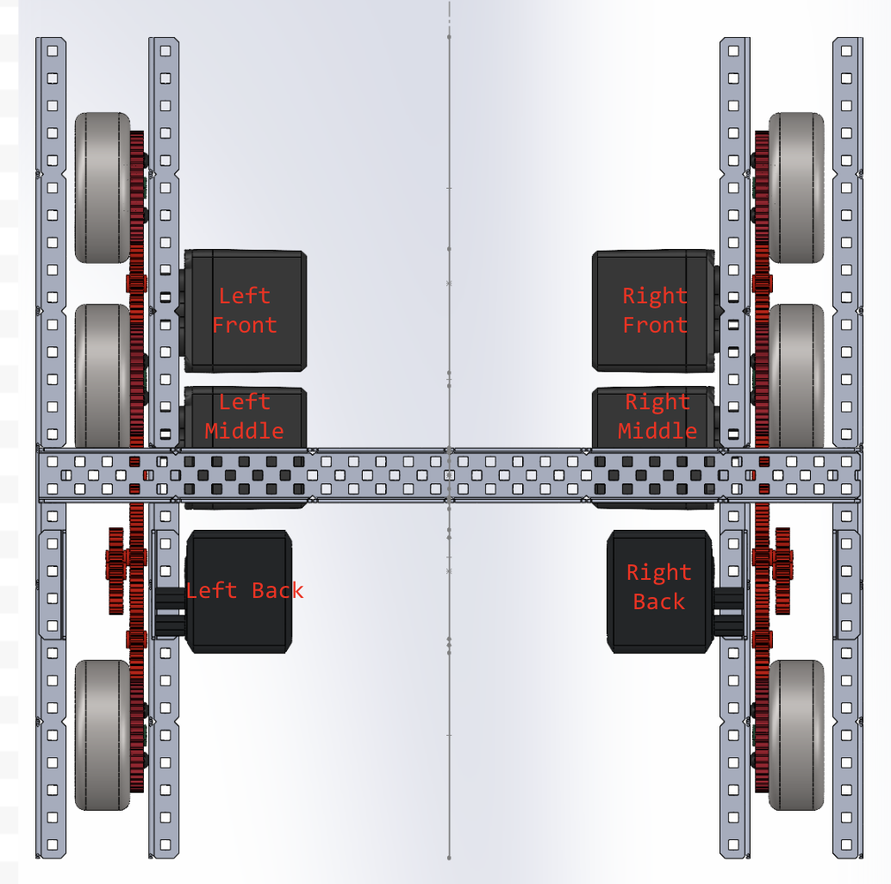

# simple-v5-lib

A beginner-friendly VEX V5 C++ library with simple, easy-to-understand PID controllers for accurate autonomous driving and turning.

## What is simple-v5-lib?

This library provides basic autonomous movement for the VEX V5 system using a PID Controller for two main movements: **Forward** and **Turn**.

Standard "move-until-target" code can cause robots to overshoot and lose accuracy. A PID controller solves this by moving fast at the beginning, slowing down at the end, and coming to a stop just as the robot reaches the target. It achieves this by using three different parts:
* **Proportional (P):** The main driving force, proportional to your distance from the target.
* **Integral (I):** The final push, overcoming friction when the P and D values become too small to move the robot.
* **Derivative (D):** The braking system, slowing the robot down as it approaches the target to prevent overshooting.

## Why simple-v5-lib?

Advanced public libraries (like PROS) often use complex methods that are difficult for beginners to understand. Using these tools too early can force you in a **"using" mindset** rather than a **"learning" mindset**. 

This library uses simple language and easy logic. It helps you get the hang of it so you can eventually build your own custom library from scratch.

## How to Use This Library

1. **Download:** Download the code.
2. **Start Project:** Start a project. If you already have one skip this step.
3. **Copy Files:** Copy simpleV5lib.cpp to your src folder. Copy simpleV5lib.h to your include folder. in main.cpp, add #include "simpleV5lib.h" at the very beginning. In simpleV5LibConfig.h, chance the ports and motor ratios to the ones of your robot. Here is a image regarding which motor name refers to which motor

This is an example of a drivetrain and what the motor names (left front, left middle, etc.) stand for:

4. **Tune:** Go to your simpleV5LibConfig.h file and tune your kp, ki, and kd constants by following this [YouTube Video Tutorial](LINK).
5. **Code:** Start writing your autonomous routes! For some examples, view the Examples folder
### Units
* Forward targets are in inches. It is worth noting that a single tile is around 23.622 inches wide.
* Turn targets are in degrees. You should know this, but 360 degrees make a full circle.

## Feedback & Support

Notice a bug or have a feature request? Please open an issue on the [GitHub Issues tab](https://github.com).